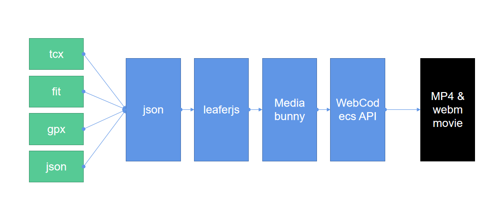

# Web Sport Data Overlay

Supports three file formats: FIT, GPX, and TCX. It can be used to create dashboard videos with background color filtering, and the generated videos have a frame rate of 1 frame per second.
The project is fully built with JavaScript.
This project relies on the professional rendering capabilities of the [leafer-ui](https://github.com/leaferjs/leafer-ui) graphics framework and the excellent performance of [Mediabunny](https://github.com/Vanilagy/mediabunny).
Thanks to the ongoing contributions of the Mediabunny project, it now supports exporting WebM format videos with transparent channels.
WebM videos with transparent channels can be edited with [Shotcut](https://github.com/mltframework/shotcut).

https://www.bilibili.com/video/BV1m9fEYRE6u/

## Runtime Environment Requirements
Browsers that support the WebCodecs API; Chrome 94 and later versions support the WebCodecs API. Microsoft Edge and Google Chrome browsers are compatible. If not supported, please upgrade your browser engine.

## Web Demo Address
https://overlay.data4u.vip/

## Principle

## Web Interface

## Supported Components

## Usage

Copy the ./pages directory to your server directory and access index.html.
The server requires HTTPS support.

## AI Support
- [豆包](https://www.doubao.com/chat/)
- [腾讯元宝](https://yuanbao.tencent.com/)

## Referenced Support Libraries
- [leafer-ui](https://github.com/leaferjs/leafer-ui)
- [mediabunny](https://github.com/Vanilagy/mediabunny)
- [layui](https://github.com/layui/layui)
- [GPXParser.js](https://github.com/Luuka/GPXParser.js)
- [BackFitClientSide](https://github.com/gfmoore/BackFitClientSide)
