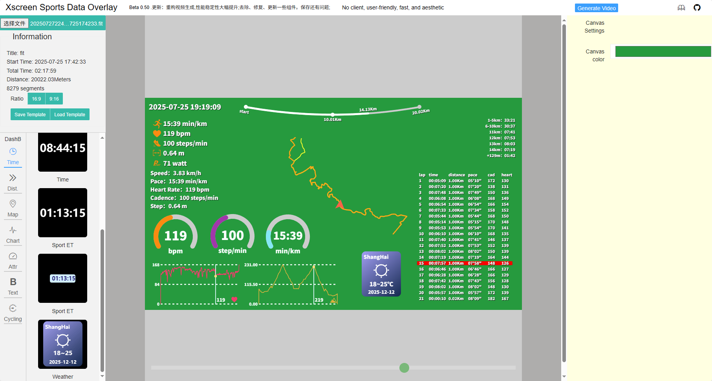
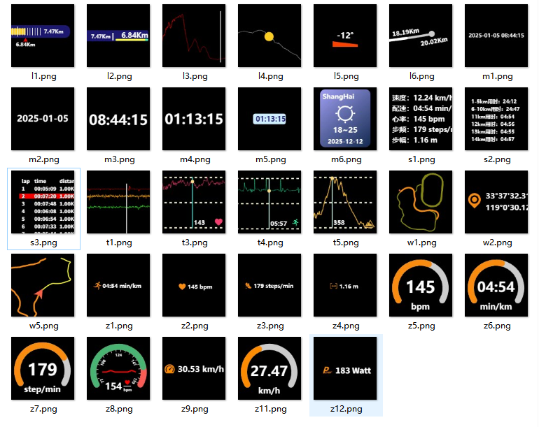

# Web Sport Data Overlay

Supports FIT, GPX, TCX files for creating dashboard videos with filterable background colors.
The frame rate of the data depends on the interval between timing points.
The current version is an initial release.

Fully built with JavaScript.

https://www.bilibili.com/video/BV1m9fEYRE6u/

## Runtime Environment Requirements
Browsers that support the WebCodecs API; Chrome 94 and later versions support the WebCodecs API. Microsoft Edge and Google Chrome browsers are compatible. If not supported, please upgrade your browser engine.

## Web Demo Address
https://overlay.data4u.vip/

## Principle

## Web Interface

## Supported Components

## Usage

Copy the ./pages directory to your server directory and access index.html.
The server requires HTTPS support.

## AI Support
- [豆包](https://www.doubao.com/chat/)
- [腾讯元宝](https://yuanbao.tencent.com/)

## Referenced Support Libraries
- [leafer-ui](https://github.com/leaferjs/leafer-ui)
- [mediabunny](https://github.com/Vanilagy/mediabunny)
- [layui](https://github.com/layui/layui)
- [jQuery](https://github.com/jquery/jquery)
- [GPXParser.js](https://github.com/Luuka/GPXParser.js)
- [BackFitClientSide](https://github.com/gfmoore/BackFitClientSide)
